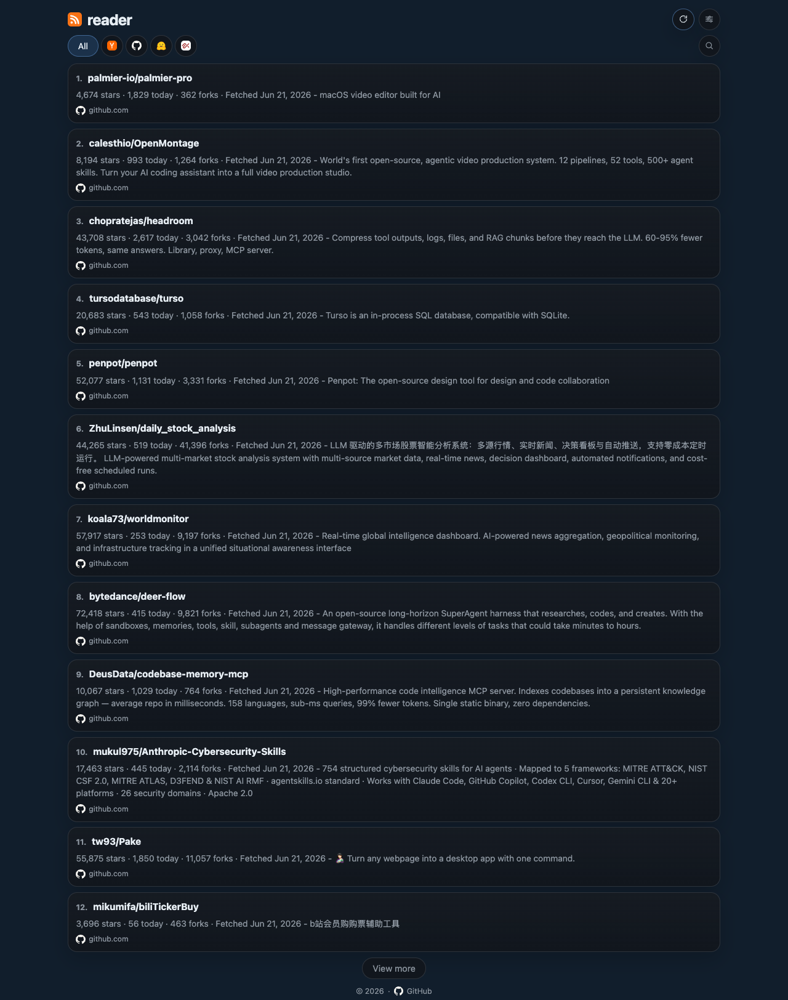

# feedreader

<p align="center">
  <strong>A tiny, fast, Cloudflare-native feed reader for engineering and research signals.</strong>
</p>

<p align="center">
  Server-rendered UI · D1 storage · Scheduled refresh · Cloudflare Workers · Visible at <a href="https://reader.boringcode.dev">reader.boringcode.dev</a>
</p>

<p align="center">
  
  
  
  
  <a href="https://github.com/boringcode-dev/feedreader-edge/actions/workflows/ci.yml"></a>
  
</p>

---

## Live site

The current production deployment is publicly visible at:

- https://reader.boringcode.dev

---

## Screenshot



---

## Features

- **Multi-source feed aggregation**
  - Hacker News
  - GitHub Trending
  - Hugging Face Trending Papers
  - alphaXiv Explore
- **Persistent edge storage** with Cloudflare D1
- **Incremental fetch model** that keeps older items in the database
- **Server-backed incremental loading**: first page loads 12 items, first-load bootstrap/filter/search/refresh show a toast-based loading state, and `View more` appends more items in place
- **Source-aware card summaries**
  - Hacker News cards show **points** and **comments**
  - GitHub cards show **stars**, **today's stars**, and **forks**
  - GitHub repo titles are normalized to canonical `owner/repo` form from the repo URL path
  - Hugging Face cards show **upvotes**
  - alphaXiv cards show **likes**
  - published/fetched dates are formatted in the browser locale while preserving the stored UTC calendar date
- **Responsive, minimalist UI** with:
  - source filters
  - real source icons in filters, dialog rows, and card metadata
  - RSS-based app icon/favicon branding
  - dark/light mode
  - inline expanding search
  - reader settings dialog for theme, density, and source visibility
- **Configurable visible sources** stored in `localStorage`
  - choose which source buttons are shown
  - when 2+ sources are enabled, `All` stays visible and aggregates over the enabled set
  - when exactly 1 source is enabled, only that source button is shown
- **Debounced client-side search UX** backed by the server API
- **Explicit empty states** for no-result source filters and searches
- **Connectivity indicator** that shows a no-wifi icon while offline and silently refreshes the current view when the browser reconnects
- **Scheduled refresh** every 1 hour on wall-clock boundaries
- **Manual refresh** from the header re-fetches the current feed view from backend stored items only; it does **not** re-fetch upstream sources
- **Persisted visited-link dimming** for feed card titles across reload/reopen using local storage
- **PWA-ready assets and offline caching** including manifest, service worker, touch icons, cached shell assets, and cached `/api/items` responses for previously visited views
- **Reconnect list refresh** re-fetches the current view from backend stored items only; it does **not** refresh upstream sources
- **Cloudflare-native deployment** with Workers, D1, Cron Triggers, and Workers Static Assets

---

## Why feedreader?

`feedreader` is designed for people who want a small, understandable reader instead of a large feed platform.

It optimizes for:

- simple operations
- low infrastructure overhead
- straightforward data ownership
- easy extension when adding more sources

---

## Tech stack

### Runtime

- TypeScript
- Cloudflare Workers
- Web Standard APIs
- `linkedom`

### Frontend

- Server-rendered HTML
- Vanilla JavaScript
- Plain CSS

### Storage

- Cloudflare D1

### Deployment

- Cloudflare Workers
- Cron Triggers
- Workers Static Assets

---

## Architecture

At a high level:

1. source adapters fetch upstream content
2. items are upserted into D1 by `(source, external_id)`
3. the Worker reads stored items ordered by article date descending
4. the cron trigger refreshes hourly on wall-clock boundaries

Key properties:

- old items are retained in the database
- fetch failures do not wipe existing data
- sources without a native article date fall back to the initial fetch time (`first_seen_at`) for ordering
- later refreshes preserve the original published/fetched ordering timestamps for existing items

---

## Project structure

```text
core/                   platform-agnostic domain logic, source adapters,
                        refresh orchestration, SSR rendering
platforms/cloudflare/   Worker entrypoint, D1 repository, migrations,
                        wrangler config
web-static/             CSS, JS, icons, manifest, service worker
docs/assets/            README screenshots and supporting images
```

---

## Getting started

### Prerequisites

- Node.js 22+
- npm
- a Cloudflare account for remote deployment

### Run locally

```bash
npm install
npm run db:migrate:local
npm run dev
```

Then open:

- `http://127.0.0.1:8788`

### Run tests

```bash
npm run typecheck
npm test
```

### First-time Cloudflare setup

```bash
npm install
wrangler login
wrangler d1 create feedreader
# copy the returned database_id into platforms/cloudflare/wrangler.toml
wrangler secret put REFRESH_SECRET --config platforms/cloudflare/wrangler.toml
npm run db:migrate:remote
```

### Deploy

```bash
npm run deploy
```

If you are reproducing this deployment in another Cloudflare account, bind the Worker to a custom domain in Cloudflare or use the generated `*.workers.dev` hostname.

---

## Configuration

Bindings configured in `platforms/cloudflare/wrangler.toml`:

- `DB` — D1 database binding
- `ASSETS` — Workers Static Assets binding for `web-static/`
- `SELF` — service binding back to the same Worker for per-source refresh fan-out

Runtime configuration:

| Variable                      |           Default | Description                                                    |
| ----------------------------- | ----------------: | -------------------------------------------------------------- |
| `FEEDREADER_ITEMS_PER_SOURCE` |              `20` | Per-source item count used in source dashboard/health contexts |
| `FEEDREADER_USER_AGENT`       |  `feedreader/0.1` | Outbound fetch user agent                                      |
| `REFRESH_SECRET`              | _required secret_ | Shared secret for internal per-source refresh fan-out routes   |

---

## Scheduling

The scheduler runs through a **Cloudflare Cron Trigger**.

Behavior:

- runs hourly via `0 * * * *`
- does **not** perform an immediate refresh just because a deploy completed
- fans out one fresh Worker invocation per source to stay within free-tier CPU budgets

On-demand refresh is available through:

- the header refresh button for re-fetching the current backend-stored feed view
- `POST /api/refresh` for triggering an immediate upstream source refresh across all sources

---

## API

### `GET /healthz`

Returns service health and per-source refresh status.

### `GET /api/items`

Returns feed items for incremental loading.

Query params:

- `source` — optional source filter (`hackernews`, `github`, `huggingface`, `alphaxiv`)
- `sources` — optional comma-separated aggregate source set used when the client wants the `All` view scoped to enabled sources (for example `hackernews,github`)
- `q` — optional case-insensitive search query across title, summary, author, URL host/path, and stored metadata
- `limit` — page size
- `offset` — pagination offset

### `POST /api/refresh`

Triggers an immediate upstream refresh across all sources and returns per-source outcomes.

### `POST /internal/refresh/:source`

Internal fan-out route used by the Worker itself. It requires the `X-Refresh-Secret` header and is not intended for external callers.

---

## Data model

The service stores a cumulative feed history.

Each fetch:

- upserts items by `(source, external_id)`
- updates refresh state in `sync_state`
- preserves older items already in the database

The UI/API render items from the full stored set, ordered by article date descending.

Presentation-layer note:

- the source adapters persist raw metadata into `metadata_json`
- the card-building layer turns that metadata into user-visible summary lines
- current rendered metrics are:
  - Hacker News: points and comments
  - GitHub: stars, today, forks
  - Hugging Face Papers: upvotes
  - alphaXiv: likes
- source icons are not embedded in the brief text itself
- the current card layout renders the real source icon inline before the host/domain line

---

## UI behavior

### Search

- the search control expands inline in the header
- clicking the search icon focuses the input
- the input renders at `16px` to avoid common iOS Safari auto-zoom behavior
- typing is debounced and only triggers the search API once the query reaches at least 2 characters
- closing the search control clears the query and resets the feed only when an active query exists
- closing an empty visible search box just hides the control and does not refetch `/api/items`

### Loading and empty states

- first-load bootstrap queries, source filter changes, searches, `View more`, and header refresh all show an explicit toast-based loading state
- source-filter changes use the generic loading toast text `Loading feed…`
- source-filter and search requests that return zero items replace the list with an empty-state message instead of leaving stale cards on screen
- `View more` disables itself while an append request is in flight and hides itself when the current result set has no further page

### Offline and connectivity

- the app shell and previously fetched `GET /api/items` views are cached by the service worker for offline reuse
- this offline/PWA behavior requires a secure-context origin where service workers are available (for example `localhost` or HTTPS)
- when the browser goes offline, a no-wifi indicator appears in the header action row instead of showing connectivity toasts
- if an offline view has no cached `/api/items` response yet, the list is replaced with `Offline and no cached items are available for this view yet.`
- when the browser comes back online, the no-wifi indicator disappears and the current view is re-fetched silently from `/api/items`
- reconnect refreshes backend-stored items only; it does not trigger upstream source refetches

### Reader settings dialog

- the configure button opens a `Reader settings` dialog
- the dialog sections are ordered as:
  - `Theme`
  - `UI density`
  - `Sources`
- theme and density options are shown in a 2-column layout to reduce dialog height
- clicking the dialog backdrop closes it
- background page scrolling is locked while the dialog is open
- selected sources are stored in `localStorage` under `feedreader.sources`
- selected density is stored in `localStorage` under `feedreader.uiDensity`
- selected theme is stored in `localStorage` under `feedreader.theme`
- source-specific filters render as **real icon-only buttons**
- `All` remains a text button
- the source dialog renders **real source icons** before each source name
- density options are:
  - `Comfortable` (default)
  - `Compact`
- if **2 or more** sources are enabled, the filter bar shows:
  - `All`
  - each enabled source
- if **exactly 1** source is enabled, the filter bar shows only that source
- the `All` view aggregates only over the enabled source set, not over disabled sources

---

## Roadmap

Potential next improvements:

- more sources (blogs, changelogs, newsletters, papers)
- server-side pagination
- source weighting and ranking controls
- more source-specific parsing fixtures
- export/import support

---

## Contributing

Contributions are welcome.

A good contribution flow:

1. fork the repository
2. create a branch
3. make changes
4. run verification locally
5. open a pull request

Example local verification:

```bash
npm run typecheck
npm test
npm run db:migrate:local
```

## CI/CD

- CI runs on pull requests and `main` pushes.
- CI checks type safety, unit tests, and a local D1 migration smoke run.
- Deploy runs on `main` pushes and manual dispatch.
- Deploy validates Cloudflare credentials, re-runs verification, applies remote D1 migrations, and deploys the Worker.

---

## Security

For security concerns, please email [hi@boringcode.dev](mailto:hi@boringcode.dev) instead of using the issue tracker. See [SECURITY.md](SECURITY.md) for more details.

---

## License

This project is licensed under the MIT License — see the [LICENSE](LICENSE) file for details.

---

## Repository hygiene

Generated runtime artifacts are intentionally ignored:

```gitignore
node_modules/
.wrangler/
.dev.vars
.envrc
*.log
```

This keeps the repository focused on source code, static assets, and documentation.
